## 🪐 About Me

- 🎓 **Computer Science** student at **Universiti Teknologi MARA (UiTM)**, Kampus Jasin Melaka
- 🚀 Currently shipping **[HireHub](https://github.com/Zack1ns/hirehub)** — a job portal with a from-scratch Random Forest career predictor
- 📊 **DataCamp-certified Associate Data Analyst** — data cleaning, visualization, statistical analysis & BI
- 🛰️ I like building things end-to-end: frontend, backend, database, and the ML in between
- 🗣️ Trilingual: Bahasa Melayu · English · basic Mandarin
- 💼 Open to **internships** and junior **software development / data analytics** roles — willing to relocate
- 📫 Reach me: [2023268156@student.uitm.edu.my](mailto:2023268156@student.uitm.edu.my) · [LinkedIn](https://www.linkedin.com/in/muhammad-zulkharith-zakwan-mohd-zulkhairil-anwar-5930b83a9/)

## 🛠️ Tech Universe

## 🛰️ Featured Mission

**💼 HireHub** — a two-sided job portal where a hand-rolled Random Forest
(no ML libraries!) predicts an applicant's best-fit career role, with client-side inference.

## 🛸 Academic Projects

Course & group projects I've collaborated on:

- 🦷 **[Dental-Service](https://github.com/Farepun/Dental-Service)** — a dental clinic service web system (CSC584 group project · HTML, CSS, SCSS, JavaScript, PHP)
- 🎟️ **[Concert Ticketing System](https://github.com/rafharo/ConcertTicketingSystem)** — a concert ticket booking system built as a course group project

## 📊 Mission Stats

## 📡 Signal Trace

## 🐍 Cosmic Snake

---

*"Per aspera ad astra — through hardships to the stars."* ✨

